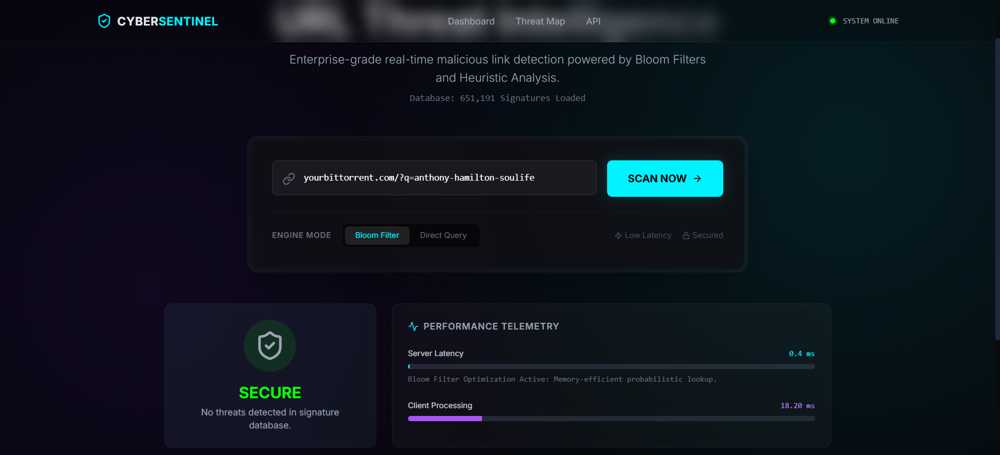

# 🛡️ CyberSentinel | Advanced URL Threat Intelligence

> **Enterprise-grade malicious URL detection system powered by Hybrid AI Architecture (Bloom Filters + Machine Learning).**


## 📖 Overview

**CyberSentinel** is a high-performance security microservice designed to detect phishing, malware, and defacement URLs in real-time. Unlike traditional blacklists that rely solely on slow database lookups, this system employs a **multi-layered hybrid architecture**:

1.  **Layer 1: Probabilistic Bloom Filters (In-Memory)** - Instant rejection of known bad/good URLs (O(k) complexity).
2.  **Layer 2: Database Confirmation** - Zero-false-positive verification for flagged entities.
3.  **Layer 3: AI/ML Inference Engine** - Real-time analysis of *unknown* URLs using an ONNX-powered Neural Network/Random Forest model.

This approach ensures **sub-millisecond latency** for 99% of requests while maintaining the ability to detect *zero-day* threats that haven't yet been blacklisted.

 *Note: Dashboard features real-time telemetry and "Cyberpunk" aesthetic.*

---

## 🚀 Key Features

### 🧠 Triple-Layer Detection Engine
-   **In-Memory Bloom Filters**: Uses **FNV-1a** and **MurmurHash2** double-hashing to store ~650,000+ signatures in a compact bit array.
-   **ONNX Runtime Integration**: Runs a pre-trained machine learning model directly in Node.js to classify unknown URLs based on lexical features.
-   **MongoDB Persistence**: Serializes Bloom Filter state to disk, allowing fast re-hydration on server restart.

### ⚡ Performance & Scalability
-   **Microsecond Latency**: Bloom filter checks take ~0.05ms.
-   **LRU Caching**: Frequently accessed results are cached in memory.
-   **Express Rate Limiting**: Protects the API from DDoS and abuse.

### 🔍 Advanced ML Feature Extraction
The system extracts **14 lexical features** from every URL for the AI model:
-   URL length & Special character counts (`@`, `//`, `?`, etc.)
-   Suspicious keyword presence (e.g., `login`, `verify`, `paypal`)
-   IP check, HTTPS validity, and Hex-encoding detection.
-   Entropy and repetition analysis.

### 🎨 Modern UI Dashboard
-   Built with **EJS** and **TailwindCSS**.
-   Features a "Glassmorphism" design with neon accents.
-   **Real-time Telemetry**: Visualizes server-side (Bloom/ML) vs client-side network latency.

---

## 🛠️ Architecture Flow

```mermaid
graph TD
    A[Client Request] --> B{LRU Cache?}
    B -- Yes --> C[Return Cached Result]
    B -- No --> D{Bloom Filter (Malicious)?}
    D -- Yes --> E[Check MongoDB (Verify Type)]
    E --> F[Return Malicious/Type]
    D -- No --> G{Bloom Filter (Benign)?}
    G -- Yes --> H[Return Safe]
    G -- No --> I[Run ONNX AI Model]
    I --> J[Feature Extraction]
    J --> K[Inference (Phishing/Malware/Defacement)]
    K --> L[Return ML Prediction]
```

---

## 📦 Installation

### Prerequisites
-   Node.js (v18+ recommended for ONNX)
-   MongoDB (Running locally or Atlas URI)

### Setup
1.  **Clone the repository**
    ```bash
    git clone https://github.com/yourusername/cybersentinel.git
    cd cybersentinel
    ```

2.  **Install Dependencies**
    ```bash
    npm install
    ```

3.  **Configure Environment**
    Create a `.env` file in the root:
    ```env
    PORT=3000
    MONGO_URI=mongodb://localhost:27017/urldetection
    ```

4.  **Download/Verify Model**
    Ensure `final_url_model.onnx` is present in the root directory.

5.  **Start the Server**
    ```bash
    npm run start
    # OR for dev
    node index.js
    ```

---

## 🔌 API Documentation

### `GET /check` (Smart Scan)
The main endpoint using the full Hybrid Engine.

**Request:**
`GET http://localhost:3000/check?url=http://suspicious-bank-login.com`

**Response:**
```json
{
  "message": "phishing",
  "responseTime": "12.45 ms"
}
```
*Possible messages: `safe`, `benign`, `phishing`, `malware`, `defacement`.*

### `GET /find` (Benchmark Mode)
Bypasses caching and Bloom Filters to query the database directly. Used for performance comparison.

**Response:**
```json
{
  "message": "phishing",
  "responseTime": "150.20 ms"
}
```

---

## 🏗️ Technology Stack

| Component | Tech | Usage |
| :--- | :--- | :--- |
| **Runtime** | Node.js | Core Execution Environment |
| **Framework** | Express v5 | API Routing & Middleware |
| **Database** | MongoDB | Persistent Storage for Signatures |
| **AI Engine** | ONNX Runtime | Running ML Models in Node |
| **Algorithms** | Bloom Filter | Probabilistic Data Structure |
| **Hashing** | FNV-1a, Murmur2 | Fast Non-Crypto Hashing |
| **Frontend** | EJS, Tailwind | Interactive Dashboard |

---

## 🧪 Deployment
The application is deployment-ready for platforms like **Render**.
*Note: Ensure the hosting environment supports `onnxruntime-node` binary dependencies.*


